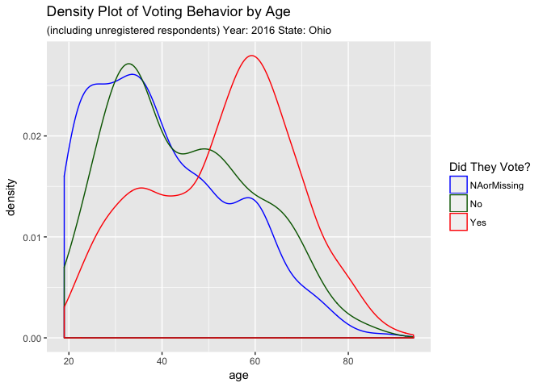
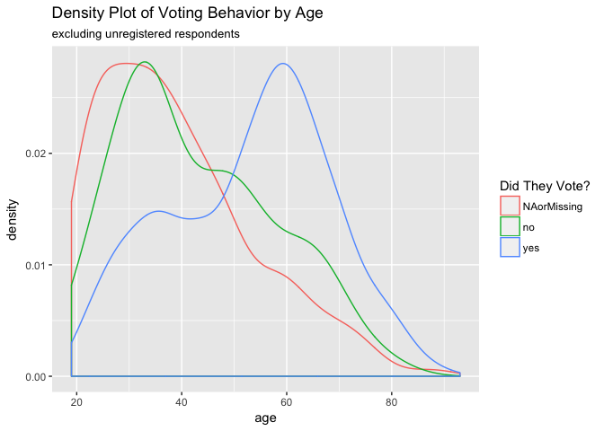
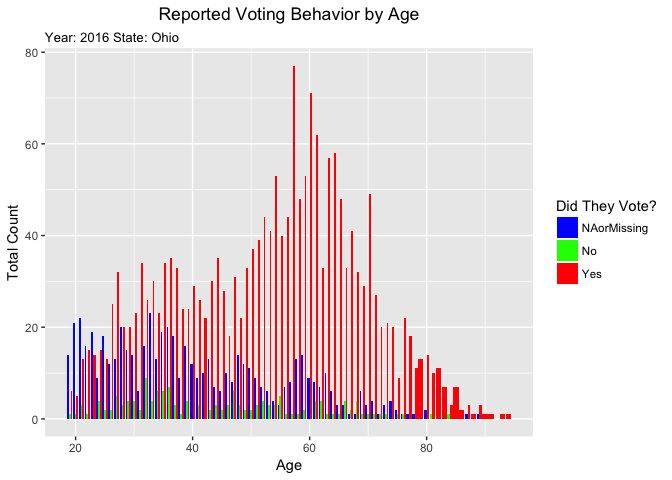
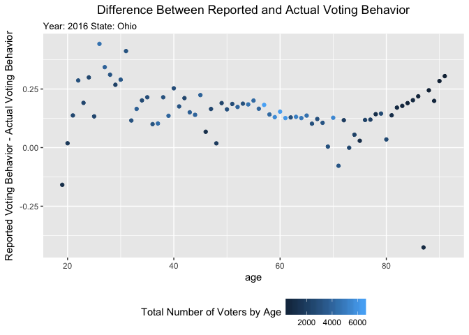
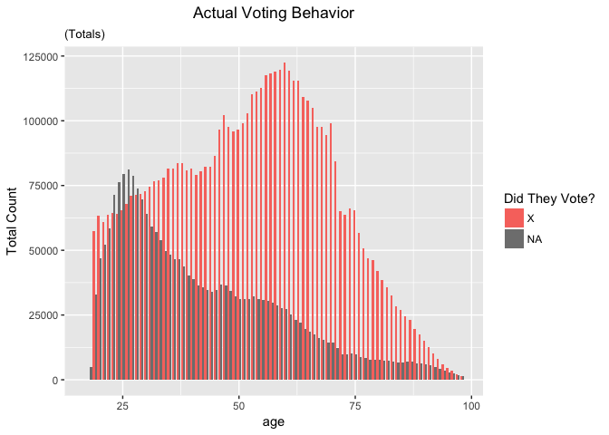
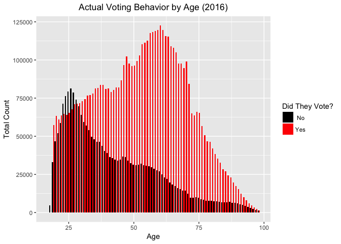

Untitled
================

``` r
#this should pull directly from the github csv
vote16 <- read.csv("~/oh-elections-project/CCES_Files/CCES16.csv")
```

``` r
#making a vote column
vote16complete <- mutate(vote16, voted = ifelse(askvote %in% 1:4,"no",
                                            ifelse(askvote %in% 5, "yes",  "NAorMissing" ))) %>%
  
#making a party column
  mutate(party = ifelse(party_ID %in% 1,"Democrat",
ifelse(party_ID %in% 2, "Republican", 
ifelse(party_ID %in% 3, "Independent",
ifelse(party_ID %in% 4, "Other",  "NAorMissing" ))))) %>%

  # making a registered column

  mutate(registered = ifelse(votereg %in% 1, "Yes", 
                                                                           ifelse(votereg %in% 2, "No", 
        ifelse(votereg %in% 3, "DontKnow", "NAorMissing"
                                    )))) %>%
  
#vote method
  mutate(method_vote = ifelse(vote_method %in% 1, "In person on election day", 
                              ifelse(vote_method %in% 2, "In person early", 
                              ifelse(vote_method %in% 3, "Voted by mail or absentee", "Dontknow_skipped_notasked"
                              )))) %>%
#remove old columns
select(weight, age, voted, party, registered, method_vote)
```

``` r
# First visualizaton: visualizing voter density by age
ggplot(vote16complete, aes(age, col = voted)) + geom_density() + ggtitle('Density Plot of Voting Behavior by Age', subtitle =  'including unregistered respondents') + labs(col = "Did They Vote?")
```



``` r
#Next I am going to filter out the voters who did not register, and then visualize density by age
filteredRegistered <- filter(vote16complete, registered == 'Yes')
ggplot(filteredRegistered, aes(age, col = voted)) + geom_density() + ggtitle('Density Plot of Voting Behavior by Age', subtitle =  'excluding unregistered respondents') + labs(col = "Did They Vote?")
```



``` r
theme_update(plot.title = element_text(hjust = 0.5))
ggplot(vote16complete, aes(age, fill = voted)) + geom_bar(position = "dodge") + ylab('Total Count') + xlab("Age") + labs(fill = "Did They Vote?") + ggtitle('Reported Voting Behavior by Age')
```



Time to visualize differences in actual and reported voting behavior
--------------------------------------------------------------------

``` r
## You must download the Ohio voting data from https://drive.google.com/open?id=0B16R3n7VKQteeEh5SmozTXRVb2s
Ohio_df_lite <- read.csv ("~/Downloads/Ohio_df_lite.csv")
 
# selecting just birthdate and voting behavior
 
ohio_date_vote <- select(Ohio_df_lite, DATE_OF_BIRTH, GENERAL.11.08.2016)  

# now that we have age and voting data, we can remove ohio_df_lite to save space
 rm(Ohio_df_lite) 
 
  #mutate the birthdate column to make an age variable
 
ohio_age_vote <- mutate(ohio_date_vote, age = 2017 - year(DATE_OF_BIRTH)) %>% filter(age < 99) %>% select(age,GENERAL.11.08.2016)
 
 # now that we have age we can remove ohio_date_vote to save space
 
 rm(ohio_date_vote)

#rename column names
colnames(ohio_age_vote) <- c("age", "vote")


#renaming the NAs. If the column is marked X it is recorded as X, if there is anything else it is changed to O
ohio_age_vote1 <- mutate(ohio_age_vote, newvote = ifelse(vote %in% "X", "X", "O"))
#what does this do?
Ohio_summary2 <- ohio_age_vote1 %>% group_by(age) %>% dplyr::summarise(perc = base::mean(newvote == "X"), n())
```

``` r
#grabing and summarizing the CCES data
viz16 <- read_csv("~/oh-elections-project/CCES_Files/vote16_long.csv")
```

    ## Warning: Missing column names filled in: 'X1' [1]

    ## Parsed with column specification:
    ## cols(
    ##   X1 = col_integer(),
    ##   weight = col_double(),
    ##   age = col_integer(),
    ##   voted = col_character(),
    ##   party = col_character(),
    ##   method_vote = col_character(),
    ##   wtd = col_integer(),
    ##   ids = col_integer()
    ## )

``` r
smallviz16 <- viz16 %>% select(age, voted) %>% group_by(age) %>% summarize(percent_voted = base::mean(voted == "yes"), n())

#tidying it up so we can merge


filteredCCES <- filter(smallviz16, age %in% 19:91)

filteredOhio <- filter(Ohio_summary2, age %in% 19:91)

#merging
merged <- merge(filteredCCES, filteredOhio, by = "age")
colnames(merged) <-c("age", "CCESpercent", "CCESN", "VoterRegPercent", "VoterRegN")


diff <- mutate(merged, CCESminusVoterReg = CCESpercent-VoterRegPercent)

#lol i dont know what this does I didn't do it but we use SEdiff to graph at the end
write_csv(diff, "diff16.csv")

SEdiff <- mutate(diff, SE = sqrt((CCESpercent*(1-CCESpercent))/CCESN + ((VoterRegPercent*(1-VoterRegPercent))/VoterRegN)))
```

``` r
#plotting
ggplot(SEdiff, aes(age, CCESminusVoterReg, col = (CCESN + VoterRegN))) + geom_errorbar(aes(ymin = CCESminusVoterReg - SE, ymax = CCESminusVoterReg + SE)) + ylab('Reported Voting Behavior Minus Actual Voting Behavior') + labs(col = "Total Number of Voters by Age") 
```



``` r
#this is the same code from the third viz
ggplot(ohio_age_vote, aes(age, fill = vote)) + geom_bar(position = "dodge") + ylab('Total Count') + labs(fill = "Did They Vote?") + ggtitle('Actual Voting Behavior', subtitle = "(Totals)" )
```



``` r
#figuring out which df to use
theme_update(plot.title = element_text(hjust = 0.5))
ggplot(ohio_age_vote1, aes(age, fill = newvote)) + geom_bar(position = "dodge") + ylab('Total Count') + xlab("Age") + ggtitle('Actual Voting Behavior by Age') + scale_fill_manual(values=c("#000000", "#FF0000"), name="Did They Vote?", breaks=c("O", "X"),  labels=c(" No", "Yes"))
```


