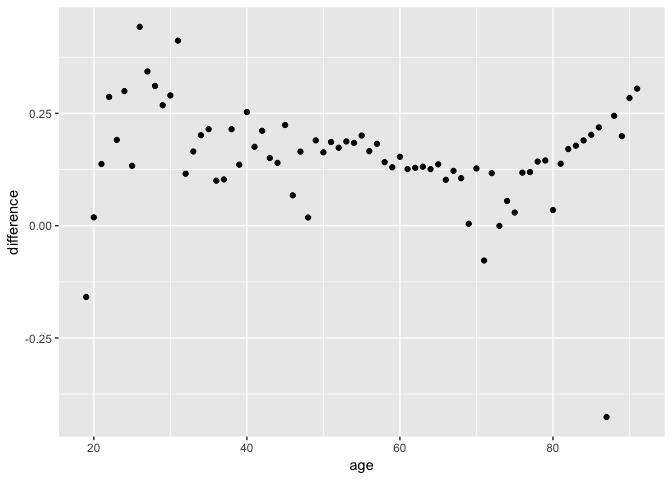

Data visualization of voting by age according to polls
================

``` r
library(readr)
library(tidyverse)
```

    ## Loading tidyverse: ggplot2
    ## Loading tidyverse: tibble
    ## Loading tidyverse: tidyr
    ## Loading tidyverse: purrr
    ## Loading tidyverse: dplyr

    ## Conflicts with tidy packages ----------------------------------------------

    ## filter(): dplyr, stats
    ## lag():    dplyr, stats

``` r
library(mdsr)
```

    ## Loading required package: mosaic

    ## Loading required package: lattice

    ## Loading required package: mosaicData

    ## Loading required package: Matrix

    ## 
    ## Attaching package: 'Matrix'

    ## The following object is masked from 'package:tidyr':
    ## 
    ##     expand

    ## 
    ## The 'mosaic' package masks several functions from core packages in order to add additional features.  
    ## The original behavior of these functions should not be affected by this.

    ## 
    ## Attaching package: 'mosaic'

    ## The following object is masked from 'package:Matrix':
    ## 
    ##     mean

    ## The following objects are masked from 'package:dplyr':
    ## 
    ##     count, do, tally

    ## The following objects are masked from 'package:stats':
    ## 
    ##     binom.test, cor, cov, D, fivenum, IQR, median, prop.test,
    ##     quantile, sd, t.test, var

    ## The following objects are masked from 'package:base':
    ## 
    ##     max, mean, min, prod, range, sample, sum

``` r
library(lubridate)
```

    ## 
    ## Attaching package: 'lubridate'

    ## The following object is masked from 'package:base':
    ## 
    ##     date

creating summary tables for voting percentage my age with Ohio data
-------------------------------------------------------------------

``` r
#download file from https://drive.google.com/a/reed.edu/uc?export=download&confirm=vfYf&id=0B16R3n7VKQteeEh5SmozTXRVb2s

# make sure Ohio_df_lite.csv is in Downloads
Ohio_df_lite <- read.csv ("~/Downloads/Ohio_df_lite.csv")

#mutate to make an age variable

Ohio_df_lite <- mutate(Ohio_df_lite, age = 2017 - year(DATE_OF_BIRTH))

ohio_age_vote <- select(Ohio_df_lite, age, GENERAL.11.08.2016) %>% filter(age < 99)
#remove ohio_df_lite to save space
rm(Ohio_df_lite)

#rename column names
colnames(ohio_age_vote) <- c("age", "vote")


#renaming the NAs
ohio_age_vote1 <- mutate(ohio_age_vote, newvote = ifelse(vote %in% "X", "X", "O"))

Ohio_summary2 <- ohio_age_vote1 %>% group_by(age) %>% dplyr::summarise(perc = base::mean(newvote == "X"))

# https://github.com/ProjectMOSAIC/mosaic/issues/625
```

polling data : summarized voting percent by age
-----------------------------------------------

``` r
viz16 <- read_csv("~/oh-elections-project/CCES_Files/vote16_long.csv")
```

    ## Warning: Missing column names filled in: 'X1' [1]

    ## Parsed with column specification:
    ## cols(
    ##   X1 = col_integer(),
    ##   weight = col_double(),
    ##   age = col_integer(),
    ##   voted = col_character(),
    ##   party = col_character(),
    ##   method_vote = col_character(),
    ##   wtd = col_integer(),
    ##   ids = col_integer()
    ## )

``` r
smallviz16 <- viz16 %>% select(age, voted) %>% group_by(age) %>% summarize(percent_voted = base::mean(voted == "yes"))
```

``` r
#tidying it up so we can merge


filteredCCES <- filter(smallviz16, age %in% 19:91) 

filteredOhio <- filter(Ohio_summary2, age %in% 19:91)
```

``` r
#merging
merged <- merge(filteredCCES, filteredOhio, by = "age")

diff <- mutate(merged, difference = percent_voted-perc)

ggplot(diff, aes(age, difference)) +geom_point()
```


